# Documanque

**Cette repo est dédié à la partie back-end, la partie front-end se trouve [ici](https://github.com/OuchenOussama/documanque).**

- Documanque est une plateforme dédiée aux documents perdus.

- Les utilisateurs du site peuvent signaler un document trouvé ou manquant.

- En précisant leurs coordonnées, toute personne disposant d'informations précieuses concernant leur annonce peut les contacter.

- Les utilisateurs peuvent être anonymes ou avoir un compte, la dernière option leur donne la possibilité de recevoir des notifications sur leurs annonces.

## Outils utilisés

- [React JS](https://reactjs.org)
- [Spring Boot](https://spring.io)
- [PostgreSQL](https://www.postgresql.org)

## Demo

Les interfaces utilisateur du projet

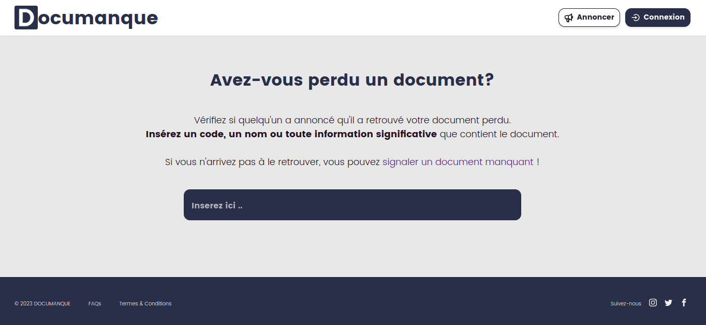
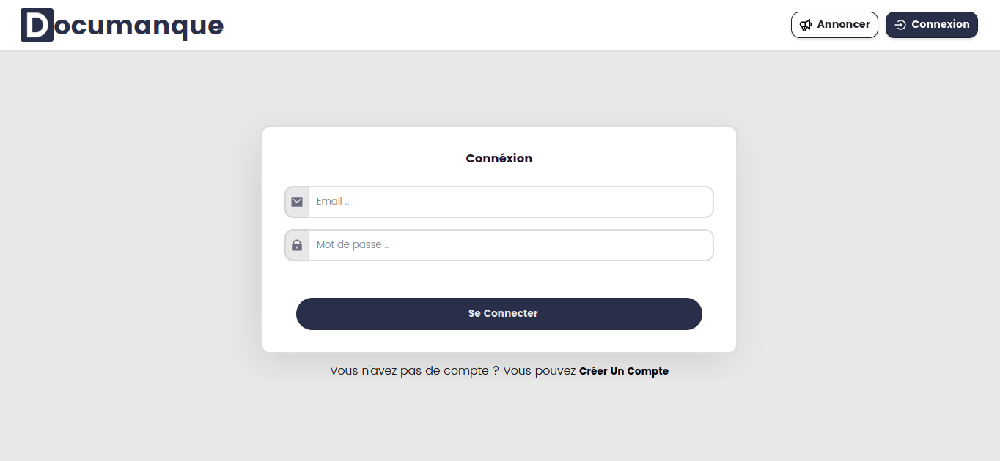
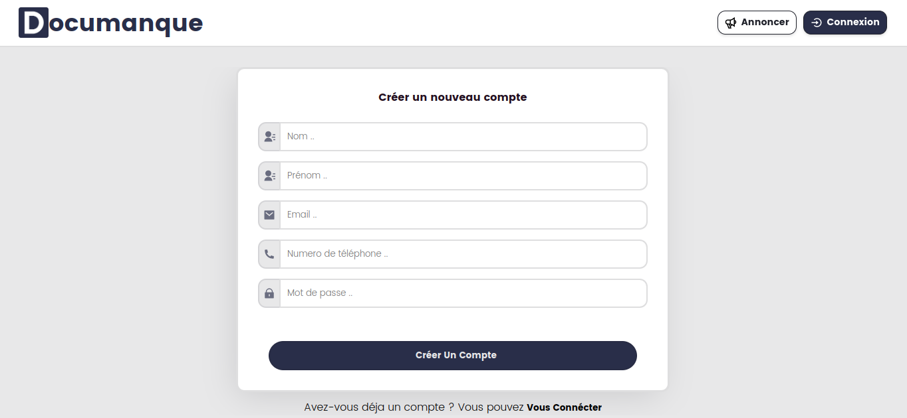
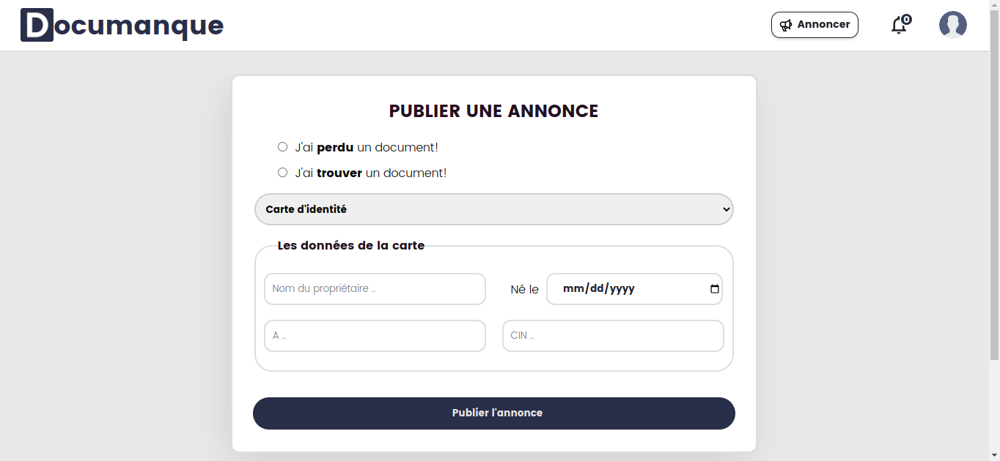
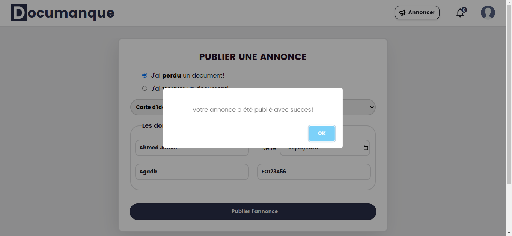
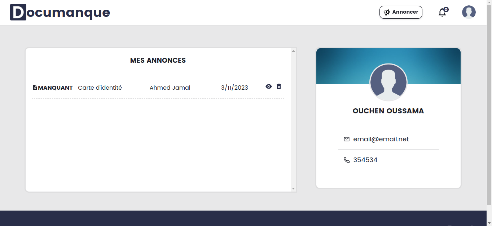
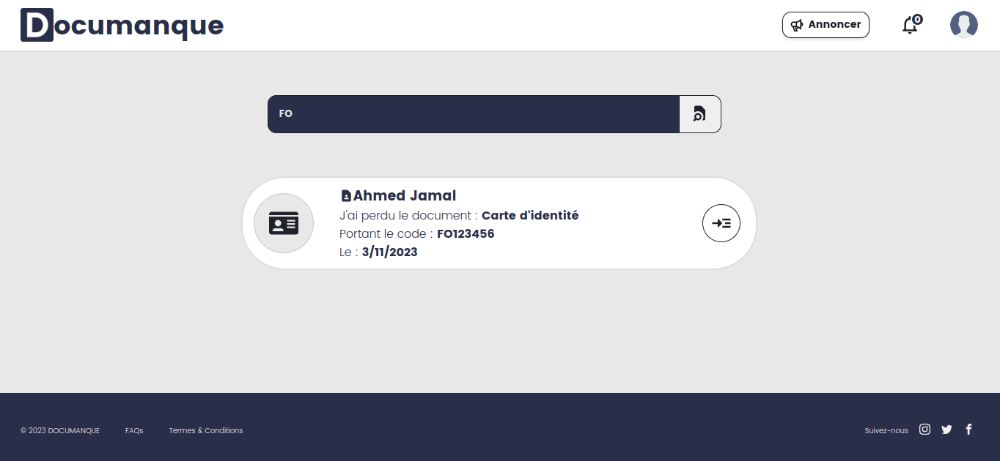
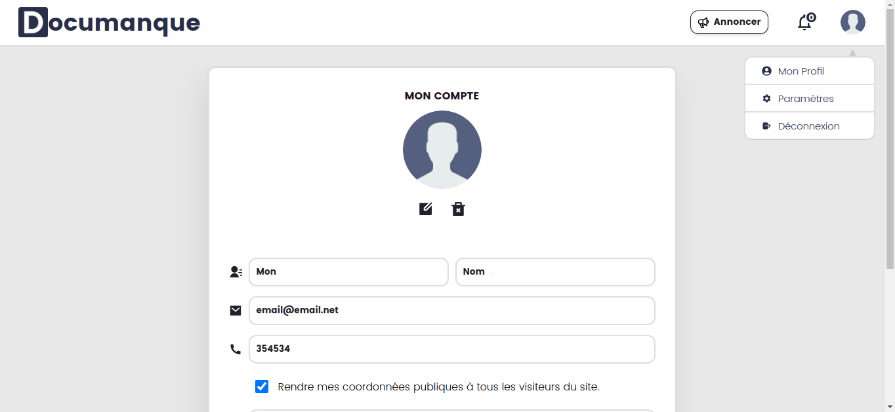
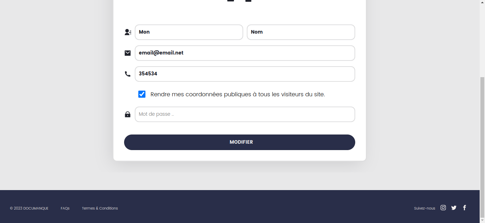
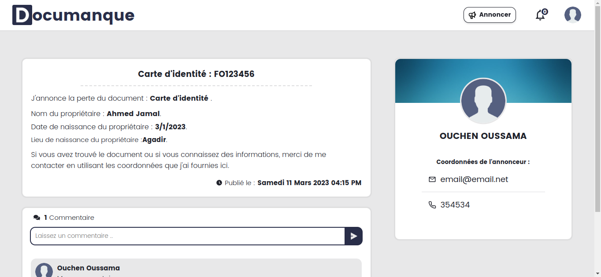
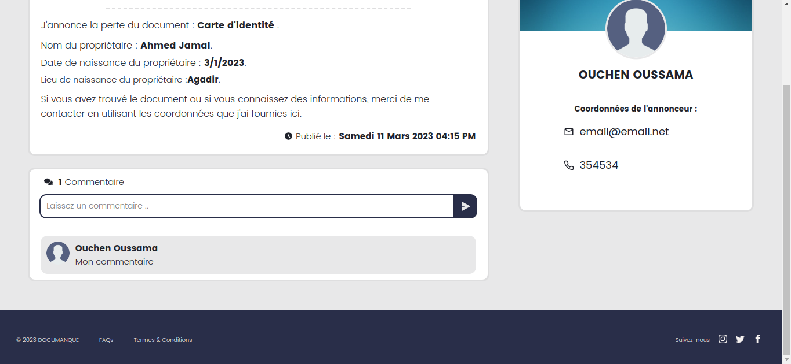
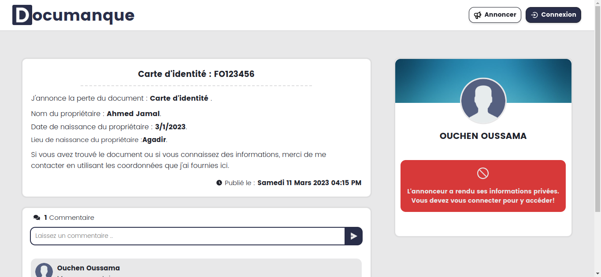
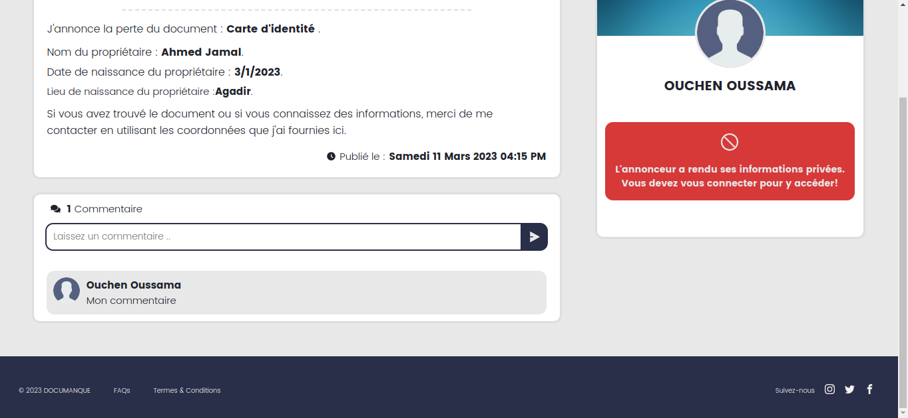